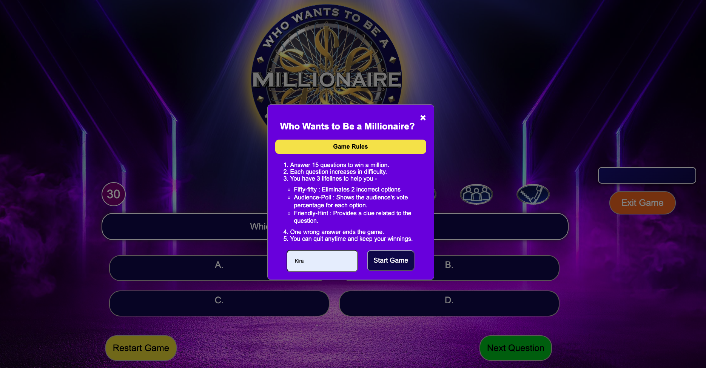
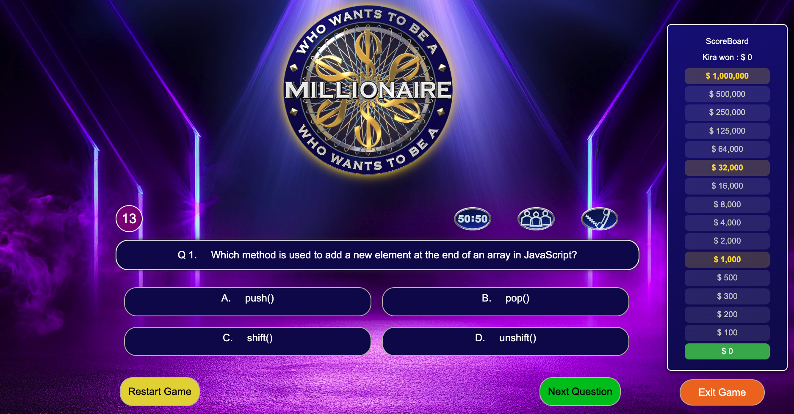
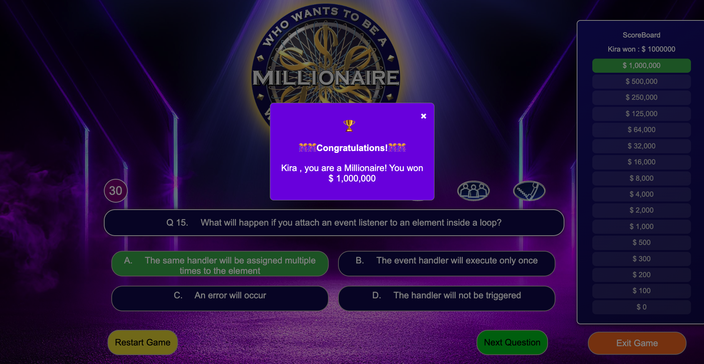
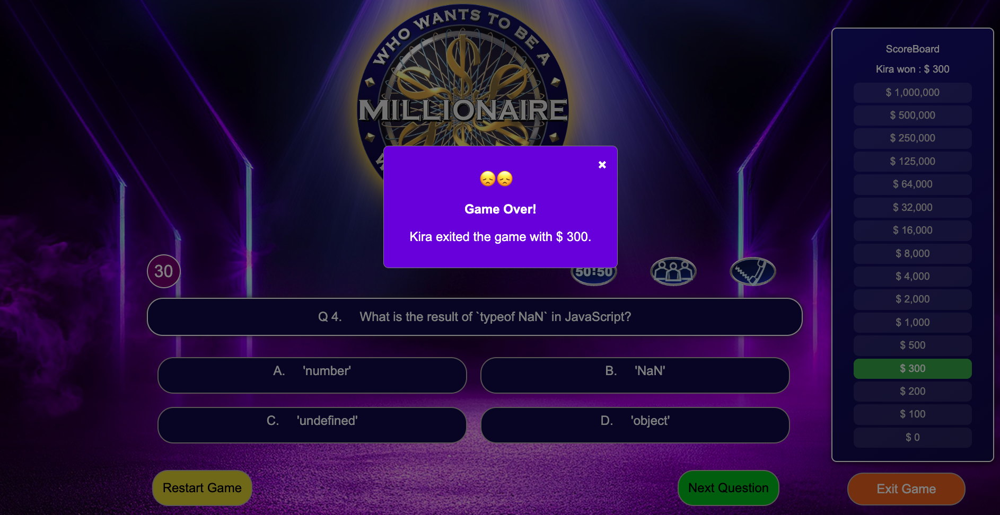
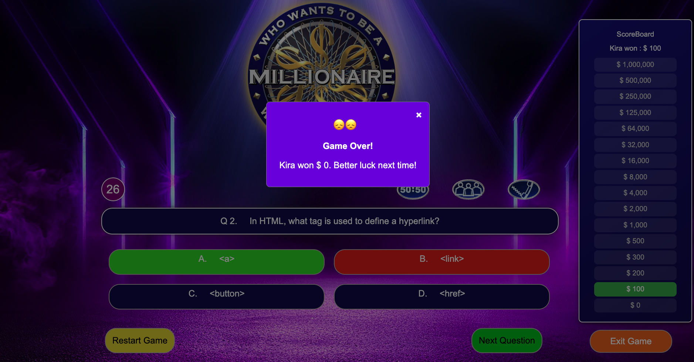

# 🎲 Millionaire Quiz Game

Welcome to the **Who Wants To Be A Millionaire? A Quiz Game**, an interactive web-based trivia game inspired by the popular TV show *Who Wants to Be a Millionaire?*. Test your knowledge, challenge yourself with tricky questions, and see if you can make it to the million-dollar question! Will you walk away a millionaire or leave with what you've earned so far? Play to find out!

## 🏗️ Technologies Used
- **Frontend:** HTML5, CSS3, JavaScript (ES6+)
- **Audio Effects:** Game sounds and event-specific audio cues for an immersive experience

## 🔗 Play the game here : [Who Wants To Be A Millionaire](https://kiran1926.github.io/millionaire-quiz-game/)

## ✨ Features
### 🔑 Game Flow
- Progressive question levels with increasing difficulty
- Score accumulation as questions are answered correctly
- Option to exit the game and retain the earned prize money
- Winning the grand prize upon answering all questions correctly

### 🎮 Lifelines
- **50:50:** Eliminates two incorrect options
- **Audience Poll:** Shows the audience's vote distribution
- **Hint:** Provides a subtle clue for the current question

### 🏆 Win or Exit
- **Win:** If all questions are answered correctly, you become a Millionaire!
- **Exit:** Option to exit the game at any point and secure the accumulated prize money
- **Game Over:** If a question is answered incorrectly, the game ends with the final score calculated based on certain milestones

### ✅ Validations and Checks
- Proper validations to prevent multiple clicks on options
- Input validation for player name during game start

## 📊 Scoring Mechanism
- **Correct Answer:** Score increases as per question level
- **Exit Game:** Retains the current score
- **Incorrect Answer:** Final score is calculated based on milestones:
  - Less than $1000 ➡️ Score: $0
  - Between $1000 and $32,000 ➡️ Score: $1000
  - Between $32,000 and $1,000,000 ➡️ Score: $32,000
  - $1,000,000 ➡️ Score: $1,000,000

## 🖼️ Screenshots
### Game Start
- 
- Enter player name and start the game
- Welcome screen with rules and instructions

### Question Screen
- 
- Displays the current question with four options
- Lifelines are visible and can be used once per game
- Audio cues for correct/wrong answers

### Game End Modal
- **Win Modal:** Congratulatory message with total prize money
- 

- **Exit Modal:** Displays prize money retained upon exiting
- 

- **Game Over Modal:** Final score with a motivational message
- 

## 🎨 UI/UX
- Intuitive user interface with a clean and modern design
- Smooth transitions and animations for a dynamic gameplay experience
- Responsive design compatible with desktop and mobile browsers

## Attributions
- This project uses the Chart.js library for data visualization.

## 🚀 How to Run the Game
1. Clone the repository:
    ```sh
    git clone https://github.com/your-username/millionaire-quiz-game.git
    ```
2. Navigate to the project folder:
    ```sh
    cd millionaire-quiz-game
    ```
3. Open `index.html` in any modern web browser.

## 🤝 Contributions
Contributions are welcome! Feel free to fork the repository, raise issues, or submit pull requests. Let's make this game more fun and engaging!

## 📄 License
This project is licensed under the MIT License.

## ❤️ Acknowledgments
Special thanks to the inspiration from *Who Wants to Be a Millionaire?* and to all contributors who helped make this project a reality.
